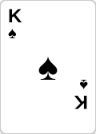

# Design Improvement Feedback (Session 5)

> **작성**: Session 5 (Design Feedback)
> **날짜**: 2025-11-21
> **목적**: Texas Hold'em 프레젠테이션의 디자인 일관성, 접근성, 사용자 경험 개선

---

## 📊 Executive Summary

### 전반적 평가

**강점 (Strengths) ✅**:
- 명확한 색상 시스템 (CSS 변수 활용)
- 훌륭한 포커 테이블 시각화
- 52장 카드 덱 그리드의 창의적 구현
- Fragment 애니메이션의 효과적 활용
- 일관된 타이포그래피 기본 구조

**개선 필요 영역 ⚠️**:
- 하드코딩된 색상 값 (CSS 변수 미사용)
- 반응형 디자인 부족
- 접근성 고려 미흡
- 간격 시스템 비일관성
- 일부 CSS 중복
- 애니메이션 성능 최적화 여지

**우선순위**:
1. **High**: 색상 일관성, 반응형 디자인, 접근성
2. **Medium**: 간격 시스템, CSS 리팩토링
3. **Low**: 애니메이션 최적화, 미세 조정

---

## 🎨 1. 색상 시스템 (Color System)

### 1.1 현재 상태

**CSS 변수 (잘 정의됨)**:
```css
:root {
  --bg-dark: #1a1a2e;
  --bg-darker: #16213e;
  --accent-red: #e94560;
  --accent-gold: #f4a261;
  --text-light: #eaeaea;
  --text-dim: #a0a0a0;
}
```

### 1.2 문제점

**하드코딩된 색상 값들** (custom.css):
```css
/* Line 56-59: Card symbols */
.spade { color: #000; }
.heart { color: #e94560; }  /* 이미 --accent-red와 같음 */
.club { color: #000; }
.diamond { color: #e94560; }

/* Line 283: Poker table background */
background: radial-gradient(ellipse at center, #2a5a2a 0%, #1a3a1a 100%);

/* Line 285: Border color */
border: 15px solid #8b4513;

/* Line 365: Card back */
background: linear-gradient(135deg, #c41e3a 0%, #8b0000 100%);

/* Line 463-466: Chip colors */
.chip.red { background: #c41e3a; }
.chip.green { background: #2a5a2a; }
.chip.black { background: #1a1a1a; }
.chip.blue { background: #2a4a8a; }
```

**index.html 내 인라인 색상들**:
```html
<!-- Line 237: -->
background: rgba(255,255,255,0.1);

<!-- Line 354-366: Action badges -->
background: #e74c3c;  /* FOLD - red */
background: #3498db;  /* CALL - blue */
background: #27ae60;  /* RAISE - green */

<!-- Line 318: Game flow border -->
border-left: 4px solid #3498db;
```

### 1.3 권장 개선사항

**CSS 변수 확장**:
```css
:root {
  /* Existing */
  --bg-dark: #1a1a2e;
  --bg-darker: #16213e;
  --accent-red: #e94560;
  --accent-gold: #f4a261;
  --text-light: #eaeaea;
  --text-dim: #a0a0a0;

  /* New additions */
  --card-black: #000000;
  --table-green: #2a5a2a;
  --table-green-dark: #1a3a1a;
  --table-border: #8b4513;

  --chip-red: #c41e3a;
  --chip-green: #2a5a2a;
  --chip-black: #1a1a1a;
  --chip-blue: #2a4a8a;

  --action-fold: #e74c3c;
  --action-call: #3498db;
  --action-raise: #27ae60;

  --overlay-bg: rgba(255, 255, 255, 0.1);
  --overlay-bg-dark: rgba(0, 0, 0, 0.3);
}
```

**적용 예시**:
```css
/* Before */
.spade { color: #000; }

/* After */
.spade { color: var(--card-black); }

/* Before */
background: radial-gradient(ellipse at center, #2a5a2a 0%, #1a3a1a 100%);

/* After */
background: radial-gradient(ellipse at center, var(--table-green) 0%, var(--table-green-dark) 100%);
```

### 1.4 색상 접근성 (Color Accessibility)

**현재 문제**:
- `--text-dim: #a0a0a0` on `--bg-dark: #1a1a2e` = **대비 부족** (WCAG AA 기준 미달 가능)
- Red-green colorblind 사용자를 위한 대체 표현 부족

**권장 개선**:
```css
/* 텍스트 대비 개선 */
--text-dim: #b0b0b0;  /* 기존 #a0a0a0에서 밝기 증가 */

/* 또는 다크모드에 맞춰 조정 */
--text-dim: #c0c0c0;
```

**색맹 사용자 고려**:
```css
/* 색상 + 형태/패턴으로 정보 전달 */
.action-fold::before { content: "✕ "; }
.action-call::before { content: "↔ "; }
.action-raise::before { content: "↑ "; }
```

---

## 📐 2. 타이포그래피 (Typography)

### 2.1 현재 상태

**폰트 패밀리**:
```css
font-family: 'Noto Sans KR', -apple-system, BlinkMacSystemFont, 'Segoe UI', sans-serif;
```
✅ 좋음: 한글 지원, 시스템 폰트 fallback

**폰트 크기**:
```css
h1: 2.5em
h2: 1.8em
h3: 1.5em
p: 1.1em
```
✅ 일관성 있음

### 2.2 문제점

**인라인 폰트 크기 (index.html)**:
- Line 585: `font-size: 1.4em;`
- Line 693: `font-size: 1.3em;`
- Line 79: `font-size: 2em;`

**비일관적인 폰트 크기 사용**:
- `.card-large`: `2em`
- `.pot-display`: `1.5em`
- `.combo-count`: `1.4em` (내부 `.number`는 `1.8em`)

### 2.3 권장 개선사항

**타이포그래피 스케일 정의**:
```css
:root {
  /* Font sizes */
  --font-xs: 0.7em;
  --font-sm: 0.8em;
  --font-base: 1em;
  --font-md: 1.1em;
  --font-lg: 1.2em;
  --font-xl: 1.4em;
  --font-2xl: 1.8em;
  --font-3xl: 2.5em;
  --font-4xl: 3.5em;

  /* Line heights */
  --line-height-tight: 1.2;
  --line-height-normal: 1.5;
  --line-height-loose: 1.8;
}
```

**적용 예시**:
```css
.reveal h1 { font-size: var(--font-3xl); }
.reveal h2 { font-size: var(--font-2xl); }
.reveal h3 { font-size: var(--font-xl); }
.reveal p { font-size: var(--font-md); }
.card-large { font-size: var(--font-2xl); }
```

**가독성 개선**:
```css
/* 긴 텍스트 블록에 대한 line-height 조정 */
.reveal p {
  line-height: var(--line-height-normal);
}

.reveal li {
  line-height: var(--line-height-normal);
}

/* Notes의 가독성 */
.reveal aside.notes {
  line-height: var(--line-height-loose);
}
```

---

## 📏 3. 레이아웃과 간격 (Layout & Spacing)

### 3.1 현재 상태

**간격 사용 예시**:
- `margin: 2em auto;`
- `margin-top: 1em;`
- `padding: 1em;`
- `gap: 0.3em;`
- `gap: 2em;`

### 3.2 문제점

**비일관적인 간격 값**:
- `0.3em`, `0.4em`, `0.5em`, `0.8em`, `1em`, `1.5em`, `2em`, `3em`
- 명확한 간격 시스템 부재

### 3.3 권장 개선사항

**간격 스케일 정의**:
```css
:root {
  /* Spacing scale (8px base) */
  --space-1: 0.25rem;  /* 4px */
  --space-2: 0.5rem;   /* 8px */
  --space-3: 0.75rem;  /* 12px */
  --space-4: 1rem;     /* 16px */
  --space-5: 1.5rem;   /* 24px */
  --space-6: 2rem;     /* 32px */
  --space-8: 3rem;     /* 48px */
  --space-10: 4rem;    /* 64px */
}
```

**적용 예시**:
```css
/* Before */
.deck-grid {
  gap: 0.3em;
  padding: 1em;
  margin: 2em auto;
}

/* After */
.deck-grid {
  gap: var(--space-2);
  padding: var(--space-4);
  margin: var(--space-6) auto;
}

/* Before */
.poker-table {
  margin: 2em auto;
}

/* After */
.poker-table {
  margin: var(--space-6) auto;
}
```

### 3.4 반응형 간격

```css
/* 모바일에서 간격 조정 */
@media (max-width: 768px) {
  :root {
    --space-6: 1.5rem;  /* 데스크톱 2rem에서 축소 */
    --space-8: 2rem;
  }
}
```

---

## 📱 4. 반응형 디자인 (Responsive Design)

### 4.1 현재 상태

**문제점**:
- **반응형 미디어 쿼리 없음**
- 고정된 크기 사용 (`.poker-table`: `800px × 500px`)
- 작은 화면에서 깨질 가능성

### 4.2 권장 개선사항

**브레이크포인트 정의**:
```css
:root {
  --breakpoint-sm: 640px;
  --breakpoint-md: 768px;
  --breakpoint-lg: 1024px;
  --breakpoint-xl: 1280px;
}
```

**Poker Table 반응형**:
```css
/* 현재 (custom.css:278-288) */
.poker-table {
  width: 800px;
  height: 500px;
  /* ... */
}

/* 개선안 */
.poker-table {
  width: min(800px, 90vw);
  height: min(500px, 60vh);
  /* ... */
}

@media (max-width: 768px) {
  .poker-table {
    width: 95vw;
    height: 50vh;
    border: 10px solid var(--table-border);
  }

  .player-seat {
    width: 80px;
    height: 80px;
  }

  .player-seat .position-label {
    font-size: 0.7em;
  }
}
```

**카드 덱 그리드 반응형**:
```css
/* 현재 (custom.css:534-545) */
.deck-grid {
  max-width: 1400px;
  grid-template-columns: repeat(13, 1fr);
  /* ... */
}

/* 개선안 */
@media (max-width: 1024px) {
  .deck-grid {
    max-width: 900px;
    gap: 0.2em;
    padding: 0.5em;
  }
}

@media (max-width: 768px) {
  .deck-grid {
    max-width: 100%;
    gap: 0.1em;
    padding: 0.3em;
  }

  .deck-grid img {
    border-radius: 0.1em;
  }
}
```

**Two-Column 레이아웃 반응형**:
```css
/* 현재 (custom.css:168-173) */
.two-column {
  display: grid;
  grid-template-columns: 1fr 1fr;
  gap: 2em;
}

/* 개선안 */
.two-column {
  display: grid;
  grid-template-columns: repeat(auto-fit, minmax(300px, 1fr));
  gap: var(--space-6);
}

@media (max-width: 768px) {
  .two-column {
    grid-template-columns: 1fr;
    gap: var(--space-4);
  }
}
```

**폰트 크기 반응형**:
```css
@media (max-width: 768px) {
  .reveal h1 { font-size: 2em; }
  .reveal h2 { font-size: 1.5em; }
  .reveal p { font-size: 1em; }

  .card-large {
    font-size: 1.5em;
    padding: 0.8em 0.6em;
  }
}
```

---

## ♿ 5. 접근성 (Accessibility)

### 5.1 현재 문제점

1. **색상 대비 부족** (이미 1.4에서 언급)
2. **키보드 네비게이션 미지원**
3. **Screen reader를 위한 ARIA 속성 부족**
4. **Focus 상태 스타일 부재**

### 5.2 권장 개선사항

**Focus 스타일 추가**:
```css
/* custom.css에 추가 */
/* Focus states for keyboard navigation */
.reveal a:focus,
.reveal button:focus {
  outline: 3px solid var(--accent-gold);
  outline-offset: 2px;
}

.card-large:focus {
  outline: 3px solid var(--accent-gold);
  transform: translateY(-5px);
}
```

**ARIA 속성 추가 (index.html)**:
```html
<!-- Before -->
<div class="poker-table">
  <div class="player-seat seat-1">
    <span class="position-label">UTG</span>
  </div>
</div>

<!-- After -->
<div class="poker-table" role="img" aria-label="Texas Hold'em poker table layout">
  <div class="player-seat seat-1" role="group" aria-label="Player position: Under The Gun">
    <span class="position-label" aria-hidden="true">UTG</span>
    <span class="position-desc">Under The Gun<br>첫 액션</span>
  </div>
</div>
```

**카드 이미지 Alt 텍스트**:
```html
<!-- Before -->


<!-- After -->

```

**Screen reader 전용 텍스트**:
```css
/* custom.css에 추가 */
.sr-only {
  position: absolute;
  width: 1px;
  height: 1px;
  padding: 0;
  margin: -1px;
  overflow: hidden;
  clip: rect(0, 0, 0, 0);
  white-space: nowrap;
  border-width: 0;
}
```

```html
<!-- 사용 예시 -->
<div class="combo-count fragment">
  가능한 조합
  <span class="number">4</span>
  <span class="sr-only">가지 조합이 가능합니다</span>
</div>
```

**색맹 사용자를 위한 패턴**:
```css
/* 빨강-초록 색맹 사용자를 위해 모양/패턴 추가 */
.action-fold::before {
  content: "✕ ";
  font-weight: bold;
}

.action-call::before {
  content: "= ";
  font-weight: bold;
}

.action-raise::before {
  content: "↑ ";
  font-weight: bold;
}

/* 또는 border 패턴 사용 */
.action-fold {
  border-left: 5px dashed var(--action-fold);
}

.action-call {
  border-left: 5px solid var(--action-call);
}

.action-raise {
  border-left: 5px double var(--action-raise);
}
```

---

## 🎬 6. 애니메이션과 인터랙션 (Animation & Interaction)

### 6.1 현재 상태

**애니메이션**:
```css
/* custom.css:480-483 - Pulse animation */
@keyframes pulse {
  0%, 100% { opacity: 1; transform: scale(1); }
  50% { opacity: 0.7; transform: scale(1.1); }
}

/* Transitions */
transition: all 0.3s ease;
transition: all 0.5s ease;
transition: width 1s ease;
```

### 6.2 문제점

1. **`all` transition 사용**: 성능 저하 가능
2. **애니메이션 지속시간 비일관적**: `0.3s`, `0.5s`, `1s`
3. **Reduced motion 고려 안 됨**

### 6.3 권장 개선사항

**Transition 최적화**:
```css
/* Before */
.card-large {
  transition: all 0.3s ease;
}

/* After - 필요한 속성만 명시 */
.card-large {
  transition: transform 0.3s ease, box-shadow 0.3s ease;
}
```

**애니메이션 시간 변수화**:
```css
:root {
  --transition-fast: 150ms;
  --transition-normal: 300ms;
  --transition-slow: 500ms;
  --easing-smooth: cubic-bezier(0.4, 0, 0.2, 1);
}

.card-large {
  transition: transform var(--transition-normal) var(--easing-smooth),
              box-shadow var(--transition-normal) var(--easing-smooth);
}
```

**Reduced Motion 지원**:
```css
/* 사용자가 애니메이션을 원하지 않을 때 */
@media (prefers-reduced-motion: reduce) {
  *,
  *::before,
  *::after {
    animation-duration: 0.01ms !important;
    animation-iteration-count: 1 !important;
    transition-duration: 0.01ms !important;
  }
}
```

**Fragment 애니메이션 개선**:
```css
/* Fragment 등장 시 부드러운 페이드인 */
.reveal .fragment {
  opacity: 0;
  transition: opacity var(--transition-slow) ease-out,
              transform var(--transition-slow) ease-out;
}

.reveal .fragment.visible {
  opacity: 1;
}

/* 카드 등장 애니메이션 */
.deck-grid img.fragment {
  opacity: 0.3;
  transform: scale(0.95);
  transition: opacity var(--transition-normal) ease-out,
              transform var(--transition-normal) ease-out;
}

.deck-grid img.fragment.current-fragment {
  opacity: 1;
  transform: scale(1.08);
}
```

**Hover 상태 개선**:
```css
/* 포커 칩 hover */
.chip:hover {
  transform: translateY(-2px);
  box-shadow: 0 4px 8px rgba(0, 0, 0, 0.4);
}

/* 액션 버튼 hover */
.action:hover {
  transform: translateY(-2px);
  box-shadow: 0 4px 8px var(--accent-gold);
}
```

---

## 🔧 7. CSS 리팩토링 (CSS Refactoring)

### 7.1 중복 제거

**현재 중복**:
```css
/* 여러 곳에서 반복되는 box-shadow */
box-shadow: 0 4px 8px rgba(0, 0, 0, 0.4);
box-shadow: 0 2px 4px rgba(0, 0, 0, 0.3);
box-shadow: 0 8px 16px rgba(0, 0, 0, 0.5);
```

**개선안 - Shadow 변수화**:
```css
:root {
  --shadow-sm: 0 1px 2px rgba(0, 0, 0, 0.2);
  --shadow-md: 0 2px 4px rgba(0, 0, 0, 0.3);
  --shadow-lg: 0 4px 8px rgba(0, 0, 0, 0.4);
  --shadow-xl: 0 8px 16px rgba(0, 0, 0, 0.5);
  --shadow-glow: 0 0 25px rgba(244, 162, 97, 1);
}

.card {
  box-shadow: var(--shadow-md);
}

.poker-table {
  box-shadow: var(--shadow-xl), inset 0 0 50px rgba(0, 0, 0, 0.3);
}

.deck-grid img.fragment.current-fragment {
  box-shadow: var(--shadow-glow), 0 0 50px rgba(244, 162, 97, 0.6);
}
```

### 7.2 유틸리티 클래스 추가

```css
/* Utility classes */
.text-center { text-align: center; }
.text-left { text-align: left; }
.text-right { text-align: right; }

.mt-1 { margin-top: var(--space-1); }
.mt-2 { margin-top: var(--space-2); }
.mt-4 { margin-top: var(--space-4); }
.mt-6 { margin-top: var(--space-6); }

.mb-1 { margin-bottom: var(--space-1); }
.mb-2 { margin-bottom: var(--space-2); }
.mb-4 { margin-bottom: var(--space-4); }
.mb-6 { margin-bottom: var(--space-6); }

.p-1 { padding: var(--space-1); }
.p-2 { padding: var(--space-2); }
.p-4 { padding: var(--space-4); }
.p-6 { padding: var(--space-6); }

.rounded-sm { border-radius: 0.25rem; }
.rounded { border-radius: 0.5rem; }
.rounded-lg { border-radius: 1rem; }
```

---

## 📋 8. 구현 우선순위 및 작업 계획

### Phase 1: Critical (높은 우선순위)

**1.1 색상 시스템 확장** (예상 30분)
- [ ] CSS 변수 추가 (chip, action, overlay colors)
- [ ] 하드코딩된 색상을 CSS 변수로 변경
- [ ] 색상 대비 개선 (--text-dim)

**1.2 반응형 디자인 기본** (예상 1시간)
- [ ] 브레이크포인트 정의
- [ ] Poker table 반응형 적용
- [ ] Card deck grid 반응형 적용
- [ ] Two-column 레이아웃 반응형 적용

**1.3 접근성 기본** (예상 45분)
- [ ] Focus 스타일 추가
- [ ] 카드 이미지 alt 텍스트 추가
- [ ] 색맹 사용자를 위한 패턴/아이콘 추가

### Phase 2: Important (중간 우선순위)

**2.1 간격 시스템** (예상 45분)
- [ ] Spacing scale 정의
- [ ] 기존 간격을 CSS 변수로 변경

**2.2 타이포그래피 개선** (예상 30분)
- [ ] Font size scale 정의
- [ ] Line height 개선

**2.3 애니메이션 최적화** (예상 30분)
- [ ] Transition 최적화 (all → 특정 속성)
- [ ] 애니메이션 시간 변수화
- [ ] Reduced motion 지원

### Phase 3: Nice to Have (낮은 우선순위)

**3.1 CSS 리팩토링** (예상 1시간)
- [ ] Shadow 변수화
- [ ] 유틸리티 클래스 추가
- [ ] 중복 제거

**3.2 ARIA 개선** (예상 30분)
- [ ] ARIA 속성 추가
- [ ] Screen reader 전용 텍스트 추가

---

## 🎯 Quick Wins (빠른 개선)

즉시 적용 가능한 개선사항:

### 1. CSS 변수 확장 (5분)

```css
/* custom.css :root에 추가 */
:root {
  /* ... existing ... */

  /* Quick additions */
  --card-black: #000000;
  --table-green: #2a5a2a;
  --action-fold: #e74c3c;
  --action-call: #3498db;
  --action-raise: #27ae60;
  --overlay-bg: rgba(255, 255, 255, 0.1);
}
```

### 2. Focus 스타일 (5분)

```css
/* custom.css 끝에 추가 */
.reveal a:focus,
.reveal button:focus {
  outline: 3px solid var(--accent-gold);
  outline-offset: 2px;
}
```

### 3. Reduced Motion (5분)

```css
/* custom.css 끝에 추가 */
@media (prefers-reduced-motion: reduce) {
  *,
  *::before,
  *::after {
    animation-duration: 0.01ms !important;
    animation-iteration-count: 1 !important;
    transition-duration: 0.01ms !important;
  }
}
```

### 4. 카드 Alt 텍스트 (10분)

```html
<!-- index.html 카드 이미지에 alt 추가 -->


```

---

## 📝 Implementation Checklist

### CSS Variables & Color System
- [ ] Extend CSS variables for all colors
- [ ] Replace hardcoded colors with CSS variables
- [ ] Improve text contrast ratios
- [ ] Add colorblind-friendly patterns

### Typography
- [ ] Define font size scale
- [ ] Define line height values
- [ ] Apply consistent typography variables
- [ ] Test readability on different screens

### Spacing & Layout
- [ ] Define spacing scale
- [ ] Apply spacing variables consistently
- [ ] Test layout on different viewports

### Responsive Design
- [ ] Define breakpoints
- [ ] Make poker table responsive
- [ ] Make card grid responsive
- [ ] Make two-column layout responsive
- [ ] Add responsive font sizes
- [ ] Test on mobile devices

### Accessibility
- [ ] Add focus styles
- [ ] Add ARIA attributes
- [ ] Add alt text to images
- [ ] Add sr-only helper class
- [ ] Test with screen reader
- [ ] Test keyboard navigation

### Animations
- [ ] Optimize transitions (avoid `all`)
- [ ] Define animation duration variables
- [ ] Add reduced motion support
- [ ] Test animation performance

### CSS Refactoring
- [ ] Create shadow variables
- [ ] Add utility classes
- [ ] Remove duplicates
- [ ] Organize CSS by sections

---

## 🚀 Next Steps

### For Session 1 (Act 2 Implementation)
현재 Act 2 작업 시 새로운 슬라이드에 이 디자인 가이드를 적용하세요:
- CSS 변수 사용
- 일관된 간격 적용
- 반응형 고려
- 접근성 속성 추가

### For Future Sessions
- **Session 3**: Act 3 구현 시 이 피드백 적용
- **Session 4**: Act 4 구현 시 이 피드백 적용
- **Session 6 (디자인 구현)**: 이 문서의 개선사항을 실제로 CSS/HTML에 적용

---

## 🐛 9. UI/UX Layout Issues (실제 레이아웃 버그)

> **중요**: 이 섹션은 이론적 개선이 아닌, **실제로 깨지거나 겹치는 레이아웃 버그**를 다룹니다.

### 9.1 우선순위 요약

**🔴 Critical (레이아웃 깨짐 - 즉시 수정 필요)**:
1. 포커 테이블 플레이어 위치 충돌
2. 카드 그리드 겹침 during animations
3. 팟 표시가 커뮤니티 카드와 겹침
4. z-index 충돌
5. 모바일 반응형 완전 부재

**🟡 Medium (UX 저하)**:
6. 프래그먼트 애니메이션 점프
7. 고정 픽셀 크기로 인한 비확장성
8. 포뮬라 빌더 시각적 분리
9. CSS 정의 중복

**🟢 Low (엣지 케이스)**:
10. 마이너 간격/오버플로우 이슈

---

### 9.2 CRITICAL: 포커 테이블 레이아웃

#### Issue 9.2.1: 플레이어 위치 Transform 충돌

**위치**: `custom.css` lines 325-330

**문제 코드**:
```css
.seat-1 { top: 50%; left: 50%; transform: translate(-50%, -180px); }  /* % + px 혼용 */
.seat-2 { top: 30%; left: 70%; }  /* transform 없음 */
.seat-4 { top: 5%; left: 50%; transform: translateX(-50%); }  /* X만 */
```

**문제점**:
- `.seat-1`의 `translate(-50%, -180px)` - 퍼센트와 픽셀 혼용으로 화면 크기 변경 시 깨짐
- `.highlight` 클래스(`transform: scale(1.2)`)가 기존 transform 덮어씀 → 요소 점프

**수정 방법**:
```css
/* 일관된 positioning 사용 */
.seat-1 {
  top: 50%;
  left: 50%;
  transform: translate(-50%, -50%) translateY(-130px);
}

.seat-1.highlight {
  transform: translate(-50%, -50%) translateY(-130px) scale(1.2);
}

.seat-4 {
  top: 5%;
  left: 50%;
  transform: translate(-50%, 0);
}

.seat-4.highlight {
  transform: translate(-50%, 0) scale(1.2);
}
```

#### Issue 9.2.2: 고정 크기로 인한 오버플로우

**위치**: `custom.css` lines 278-288

**문제 코드**:
```css
.poker-table {
  width: 800px;    /* 고정 픽셀 */
  height: 500px;   /* 고정 픽셀 */
}
```

**문제점**:
- 800px 미만 화면에서 테이블이 잘림 또는 가로 스크롤 발생
- 플레이어 위치(%)가 고정 크기 기준이라 작은 화면에서 어긋남

**수정 방법**:
```css
.poker-table {
  width: min(800px, 90vw);
  height: min(500px, 60vh);
  aspect-ratio: 8/5;  /* 비율 유지 */
}

@media (max-width: 768px) {
  .poker-table {
    width: 95vw;
    height: auto;
    border-width: 10px;  /* 테두리도 축소 */
  }
}
```

#### Issue 9.2.3: 팟 표시 겹침

**위치**: `custom.css` lines 333-340, 428-441

**문제 코드**:
```css
.community-cards {
  top: 50%;  /* 중앙 */
}

.pot-display {
  top: 60%;  /* 10% 아래 */
  font-size: 1.5em;
  padding: 0.6em 1.2em;
}
```

**문제점**:
- 커뮤니티 카드 높이(~3em) + 팟 높이(~3.6em) > 10% 간격 → 겹침
- 작은 화면에서 더 심각

**수정 방법**:
```css
.pot-display {
  top: 70%;  /* 또는 calc(50% + 150px) */
  z-index: 4;
}

.community-cards {
  z-index: 5;  /* 카드가 위에 */
}
```

---

### 9.3 CRITICAL: 카드 덱 그리드

#### Issue 9.3.1: 카드 확대 시 겹침

**위치**: `custom.css` lines 567-575

**문제 코드**:
```css
.deck-grid {
  gap: 0.3em;  /* 너무 작음 */
}

.deck-grid img.fragment.current-fragment {
  transform: scale(1.08);  /* 8% 확대 */
  z-index: 10;
  position: relative;
}
```

**문제점**:
- 0.3em 간격으로 13개 카드 배치
- 8% 확대 시 인접 카드와 시각적 겹침
- 13컬럼에서 가장자리 카드는 그리드 경계 넘어감

**수정 방법**:
```css
.deck-grid {
  gap: 0.5em;  /* 간격 증가 */
  overflow: visible;  /* 확대 카드가 잘리지 않도록 */
}

.deck-grid img.fragment.current-fragment {
  transform: scale(1.05) translateY(-5px);  /* 확대 줄이고 위로 */
  /* 또는 scale(1.08)만 유지하고 gap을 더 늘림 */
}
```

#### Issue 9.3.2: 하이라이트 오버레이 z-index 충돌

**위치**: `custom.css` lines 578-605

**문제 코드**:
```css
.highlight-overlay {
  z-index: 20;          /* 현재 프래그먼트(z:10)보다 높음 */
  pointer-events: none;
}
```

**문제점**:
- 오버레이(z:20)가 현재 프래그먼트(z:10)를 가림
- 시각적으로 강조되어야 할 카드가 오버레이에 가려짐

**수정 방법**:
```css
.highlight-overlay {
  z-index: 5;  /* 프래그먼트 아래로 */
  pointer-events: none;
}

.highlight-overlay img {
  pointer-events: none;  /* 명시적 설정 */
}
```

#### Issue 9.3.3: 포뮬라 빌더 간격

**위치**: `custom.css` lines 630-705

**문제 코드**:
```css
.formula-builder {
  grid-column: 1 / -1;
  margin-top: 2em;
  min-width: 300px;  /* 작은 화면에서 오버플로우 */
}
```

**문제점**:
- 2em margin-top으로 카드와 시각적 분리
- min-width 300px가 좁은 화면에서 넘침

**수정 방법**:
```css
.formula-builder {
  grid-column: 1 / -1;
  margin-top: clamp(1em, 3vh, 2em);
  max-width: 90%;  /* min-width 대신 max-width */
  width: fit-content;
  min-width: 0;  /* min-width 제거 */
}
```

---

### 9.4 CRITICAL: 프래그먼트 애니메이션 점프

#### Issue 9.4.1: Transform 덮어쓰기

**위치**: `custom.css` lines 291-304

**문제 코드**:
```css
.player-seat.highlight {
  transform: scale(1.2);  /* 기존 transform 덮어씀 */
}
```

**문제점**:
- `.seat-1`, `.seat-4`의 위치 조정 transform이 사라짐
- 요소가 원래 위치로 점프 후 확대

**수정 방법**:
```css
/* 각 seat별로 highlight 정의 */
.seat-1.highlight {
  transform: translate(-50%, -50%) translateY(-130px) scale(1.2);
}

.seat-4.highlight {
  transform: translate(-50%, 0) scale(1.2);
}

/* 또는 CSS 변수 활용 */
.player-seat {
  --seat-transform: none;
}

.seat-1 {
  --seat-transform: translate(-50%, -50%) translateY(-130px);
  transform: var(--seat-transform);
}

.player-seat.highlight {
  transform: var(--seat-transform) scale(1.2);
}
```

#### Issue 9.4.2: Flow Stage 가로 이동

**위치**: `custom.css` lines 740-744 (ACT2-FEEDBACK-AND-GUIDE.md 참조)

**문제 코드**:
```css
.flow-stage.current-fragment {
  transform: translateX(10px);  /* 오른쪽 10px 이동 */
}
```

**문제점**:
- 요소가 오른쪽으로 이동하면서 후속 요소들도 리플로우
- 텍스트가 뛰어다니는 효과

**수정 방법**:
```css
.flow-stage.current-fragment {
  margin-left: 10px;  /* transform 대신 margin */
  /* 또는 */
  transform: scaleX(1.02);
  transform-origin: left center;
}
```

#### Issue 9.4.3: Action Card 점프

**위치**: `custom.css` lines 785-790 (ACT2-FEEDBACK-AND-GUIDE.md 참조)

**문제 코드**:
```css
.action-card.current-fragment {
  transform: translateY(-5px);
}
```

**문제점**:
- Flexbox/grid에서 위로 이동하면 baseline 어긋남
- 하단 그림자가 아래 요소와 겹침

**수정 방법**:
```css
.action-card.current-fragment {
  margin-top: -5px;
  margin-bottom: 5px;  /* 그림자 공간 확보 */
}
```

---

### 9.5 CRITICAL: Two-Column CSS 충돌

**위치**: `custom.css` line 168-173 AND `style.css` line 121-126

**문제 코드**:

`custom.css`:
```css
.two-column {
  gap: 2em;
  align-items: start;
}
```

`style.css`:
```css
.two-column {
  gap: 3em;        /* 다른 값 */
  margin-top: 2em;
}
```

**문제점**:
- CSS 캐스케이드로 두 파일의 속성이 섞임
- `gap`은 custom.css 우선, `margin-top`은 style.css에서만 적용
- 슬라이드마다 간격이 다를 수 있음

**수정 방법**:
```css
/* custom.css에서 모든 속성 명시 */
.two-column {
  display: grid;
  grid-template-columns: 1fr 1fr;
  gap: 2em;
  align-items: start;
  margin-top: 0;  /* style.css 덮어쓰기 */
}

/* style.css에서 제거하거나 다른 클래스명 사용 */
```

---

### 9.6 CRITICAL: z-index 계층 정리

**현재 문제**:
- `.current-fragment`: `z-index: 10`
- `.highlight-overlay`: `z-index: 20`
- `.combo-count`: `z-index: 5`
- `.pot-display`, `.community-cards`: z-index 없음

**권장 z-index 체계**:
```css
:root {
  --z-background: 0;
  --z-normal: 1;
  --z-formula: 5;
  --z-overlay-background: 8;
  --z-fragment-current: 10;
  --z-modal: 100;
}

/* 적용 */
.deck-grid img { z-index: var(--z-normal); }
.combo-count { z-index: var(--z-formula); }
.highlight-overlay { z-index: var(--z-overlay-background); }
.current-fragment { z-index: var(--z-fragment-current); }
.community-cards { z-index: var(--z-formula); }
.pot-display { z-index: calc(var(--z-formula) - 1); }
```

---

### 9.7 MEDIUM: 반응형 부재

#### Issue 9.7.1: 모바일에서 깨지는 요소들

**문제 요소**:
1. `.poker-table`: 800px 고정
2. `.deck-grid`: 13컬럼 고정 (모바일에서 카드 크기 ~20px)
3. `.two-column`: 항상 2컬럼

**필수 미디어 쿼리**:
```css
@media (max-width: 768px) {
  /* 포커 테이블 */
  .poker-table {
    width: 95vw;
    height: auto;
    aspect-ratio: 16/10;
  }

  .player-seat {
    width: 70px;
    height: 70px;
  }

  /* 카드 덱 그리드 */
  .deck-grid {
    grid-template-columns: repeat(7, 1fr);  /* 2행으로 */
    gap: 0.2em;
  }

  /* 투 컬럼 */
  .two-column {
    grid-template-columns: 1fr;
  }

  /* 카드 크기 */
  .card-large {
    font-size: 1.5em;
    padding: 0.6em 0.5em;
  }
}

@media (max-width: 480px) {
  .deck-grid {
    grid-template-columns: repeat(5, 1fr);  /* 더 작은 화면 */
  }
}
```

---

### 9.8 MEDIUM: Overflow 문제

#### Issue 9.8.1: 커뮤니티 카드 너비 초과

**위치**: HTML lines 735-741

**문제**:
- 5개 카드 × (1.5em width + 1.6em padding) + gaps = ~35em
- 포커 테이블 800px (50em @ 16px) 대비 70% → 작은 화면에서 넘침

**수정**:
```css
.community-cards {
  flex-wrap: wrap;
  justify-content: center;
  max-width: 90%;
}

.card-large {
  font-size: clamp(1em, 3vw, 2em);  /* 반응형 크기 */
}
```

#### Issue 9.8.2: 슬라이드 세로 오버플로우

**문제**:
- Reveal.js 슬라이드: 1080px 높이
- 여백(8%) 제외: ~994px 사용 가능
- 포커 테이블(564px) + 텍스트(100px) + fragments = 넘칠 수 있음

**수정**:
```css
/* 여백 줄이기 */
.poker-table {
  margin: 1em auto;  /* 2em → 1em */
}

/* 또는 슬라이드 분리 */
/* 너무 많은 요소가 있는 슬라이드는 2-3개로 분할 */
```

---

### 9.9 LOW: 마이너 이슈

#### Issue 9.9.1: 비디오 컨테이너 센터링

**위치**: `custom.css` lines 189-197

**수정**:
```css
.video-container {
  width: min(80%, 800px);  /* 90%가 아닌 80% */
  aspect-ratio: 16/9;
}

.video-container > * {
  max-width: 100%;
}
```

#### Issue 9.9.2: 그리드 간격 최적화

**수정**:
```css
.deck-grid {
  gap: 0.5em;  /* 0.3em → 0.5em */
}
```

---

### 9.10 구현 체크리스트 (레이아웃 버그)

#### 🔴 Phase 1: Critical Fixes (예상 2시간)
- [ ] **포커 테이블 플레이어 위치** (30분)
  - [ ] `.seat-1`, `.seat-4` transform 통일
  - [ ] `.highlight` 클래스 개별 정의
- [ ] **카드 덱 간격** (20분)
  - [ ] `gap: 0.3em → 0.5em`
  - [ ] `scale(1.08)` → `scale(1.05)` 또는 `translateY(-5px)` 추가
- [ ] **팟 표시 겹침** (15분)
  - [ ] `top: 60% → 70%`
  - [ ] z-index 설정 (cards: 5, pot: 4)
- [ ] **z-index 체계화** (30분)
  - [ ] z-index CSS 변수 정의
  - [ ] 모든 요소에 적용
- [ ] **기본 반응형** (45분)
  - [ ] 768px 브레이크포인트 추가
  - [ ] 포커 테이블 `width: min(800px, 90vw)`
  - [ ] 덱 그리드 7컬럼으로 축소
  - [ ] 투 컬럼 → 1컬럼

#### 🟡 Phase 2: UX Improvements (예상 1.5시간)
- [ ] **프래그먼트 애니메이션** (45분)
  - [ ] `.highlight` transform 덮어쓰기 수정
  - [ ] `.flow-stage` translateX → margin-left
  - [ ] `.action-card` translateY → margin 조정
- [ ] **CSS 중복 제거** (30분)
  - [ ] `.two-column` 통일 (custom.css만 사용)
  - [ ] style.css에서 제거 또는 다른 클래스명
- [ ] **포뮬라 빌더** (15분)
  - [ ] `margin-top: clamp(1em, 3vh, 2em)`
  - [ ] `min-width: 300px → max-width: 90%`

#### 🟢 Phase 3: Polish (예상 30분)
- [ ] **커뮤니티 카드 반응형** (15분)
  - [ ] `font-size: clamp(1em, 3vw, 2em)`
  - [ ] `flex-wrap: wrap`
- [ ] **슬라이드 여백 최적화** (15분)
  - [ ] 주요 요소 `margin: 2em → 1em`

---

### 9.11 테스트 가이드

#### 필수 테스트 환경
1. **데스크톱**: 1920×1080 (기본)
2. **태블릿**: 768×1024 (세로), 1024×768 (가로)
3. **모바일**: 375×667 (iPhone SE), 414×896 (iPhone 11)

#### 테스트 항목
- [ ] 포커 테이블 플레이어 위치 정확
- [ ] `.highlight` 적용 시 요소 점프 없음
- [ ] 카드 덱 현재 프래그먼트 겹침 없음
- [ ] 팟 표시 커뮤니티 카드와 분리
- [ ] z-index 순서 정확 (오버레이 < 프래그먼트)
- [ ] 모바일에서 가로 스크롤 없음
- [ ] 모바일에서 텍스트 가독성 유지
- [ ] 프래그먼트 전환 시 부드러움

#### 테스트 방법
```bash
# 로컬 서버 실행
python -m http.server 8000

# 브라우저 개발자 도구 → Device Toolbar
# 또는 실제 기기에서 테스트
```

---

## 📚 References

- [WCAG 2.1 Guidelines](https://www.w3.org/WAI/WCAG21/quickref/)
- [MDN: CSS Custom Properties](https://developer.mozilla.org/en-US/docs/Web/CSS/Using_CSS_custom_properties)
- [MDN: Responsive Design](https://developer.mozilla.org/en-US/docs/Learn/CSS/CSS_layout/Responsive_Design)
- [WebAIM: Contrast Checker](https://webaim.org/resources/contrastchecker/)
- [Colorblind Web Page Filter](https://www.toptal.com/designers/colorfilter/)

---

**Document Status**: ✅ Complete
**Ready for**: Implementation by design-focused session or gradual adoption by content sessions
