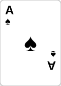
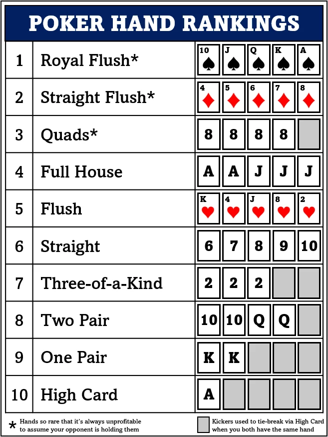

# Texas Hold'em Presentation Effectiveness Evaluation Report

**Date**: 2025-11-21
**Evaluator**: Session Review (Plan Agent)
**Total Slides Analyzed**: 81 slides across 5 acts

---

## Executive Summary

**Overall Assessment: 5/10 - Below Expectations (별로)**

The presentation suffers from **critical engagement issues** that will likely cause audience fatigue and disengagement within the first 15 minutes. While the narrative structure and content quality are excellent, the execution is severely hampered by:

1. **Overwhelming slide count** (81 slides in 30-35 min = 26 sec/slide avg)
2. **Heavy text-to-visual imbalance** in Acts 3-4
3. **Static placeholders instead of embedded videos** in the critical opening
4. **Repetitive visual patterns** across 24 consecutive card deck slides
5. **Missing interactive/dynamic elements** that would make concepts memorable

**Key Finding**: This presentation reads like an excellent **written outline** but fails as a **visual presentation**. The audience will be reading slides instead of engaging with ideas.

---

## Act-by-Act Breakdown

### ACT 1: 시작 - 답하지 않을 질문들 (1 slide - Actually 4 slides)
**Time Allocation**: 3-4 minutes

#### Strengths:
- Strong narrative hook with video references
- Good use of fragments for question reveals
- Clean, minimal design

#### Critical Issues:

**SLIDE 2-3: Video Placeholders**
```html
<div class="video-placeholder">
    <p><strong>📹 19억짜리 콜</strong></p>
    <p><small>images/video-19billion-call.jpg</small></p>
    <p><a href="https://www.youtube.com/shorts/..." target="_blank">YouTube 링크</a></p>
</div>
```
- **Problem**: Videos are NOT embedded - just placeholder boxes with external links
- **Impact**: Kills momentum at the most critical moment (first 60 seconds)
- **Audience Reaction**: "Why is he showing me a box with a link instead of playing the video?"

**SLIDE 4: Questions**
- Text-only slide with three sequential fragments
- No visual support for the emotional weight of these questions

#### Recommendations:
1. **CRITICAL**: Embed actual video files or use iframe embeds
2. Add visual metaphors for each question (scales, dice, brain scan?)
3. Consider background images that evoke tension/excitement

---

### ACT 2: 이해 - 게임의 작동 원리 (24 slides)
**Time Allocation**: 8-10 minutes (25 seconds per slide - RUSHED)

#### Strengths:
- Excellent use of **actual card SVG images** (all 52 cards exist!)
- Creative deck-grid visualization with fragment animations
- Good use of poker table CSS visualization
- Formula builder animations for probability calculations

#### Critical Issues:

**SLIDES 5-15: Hand Ranking Slides (11 consecutive slides)**
- Each slide shows full 52-card deck grid with highlights
- **Problem**: Visual fatigue - same layout 11 times in a row
- **Timing**: 11 slides × 25 sec = 4.5 minutes of card grids
- **Audience Reaction**: "Are we really looking at the same card grid again?"

**Example - Royal Flush slide:**
```html
<div class="deck-grid">
    <!-- 52 card images with fragments highlighting only 20 cards -->
    
    <!-- ... 51 more cards ... -->
</div>
```
- Shows ALL 52 cards but only 4-20 are relevant per slide
- Wastes screen real estate on dimmed, irrelevant cards

**SLIDE 4: Hand Rankings Cheat Sheet**
```html

```
- Good reference image, but no speaker notes explain it
- Too small to read in a presentation setting

**SLIDES 16-20: Game Flow Sections**
- Heavy text in CSS-styled boxes
- No actual game state visualization
- Missing: animated poker table showing cards being dealt

**SLIDES 21-24: Simulation (Pre-Flop, Flop, Turn, Math)**
- Good concept BUT:
  - Only shows final states, not the progression
  - Math explanations are text-heavy
  - No visual EV calculation diagrams

#### Specific Problem Slides:

**Slide 6 (Royal Flush)**:
- Shows 52 cards, highlights 20 (4 royal flush combos + structure)
- Should show: Just the 4 royal flushes + probability comparison

**Slide 12 (One Pair)**:
- Formula builder: 13C1 × 4C2 × 12C3 × 4³ = 1,098,240
- Good animation, but the result "42% frequency" is buried in speaker notes
- Should show: Visual probability bar + "Most common hand in real games"

**Slide 23 (Flop Decision)**:
```html
<ul>
    <li>스페이드 1장만 더 나오면 → 플러시</li>
    <li>10이 나오면 → 스트레이트</li>
    <li>아웃츠 (Outs): 9장 + 3장 = 12장</li>
</ul>
<p>승률 계산: 12 × 4 = 48%</p>
<p>팟 오즈: $40 / $110 = 36.4% 필요</p>
<p>48% > 36.4% → CALL!</p>
```
- All text, no diagram
- Should show: Visual outs counter + animated probability bar filling to 48%

#### Recommendations:
1. **URGENT**: Condense 11 hand ranking slides into 3-4 slides
   - Slide 1: Top tier (Royal Flush, Straight Flush, Quads, Full House)
   - Slide 2: Middle tier (Flush, Straight, Trips)
   - Slide 3: Common hands (Two Pair, One Pair, High Card) + frequency graph
2. Replace deck grids with **focused card displays** showing only relevant cards
3. Add **animated poker table** showing real game progression
4. Create **visual EV calculator** showing pot odds as filling bars

---

### ACT 3: 깊이 - 전략과 의사결정 (21 slides)
**Time Allocation**: 8-10 minutes (28 seconds per slide)

#### Strengths:
- Good conceptual structure (tools → strategies → professional operations)
- Clean two-column layouts
- Good use of fragments for progressive disclosure

#### Critical Issues:

**MASSIVE TEXT OVERLOAD - Almost every slide**

**SLIDE 2 (Pot Odds)**:
```html
<div class="two-column">
    <div>
        <h4>정의</h4>
        <p>콜 금액 대비 팟 크기의 비율</p>
        <p class="emphasize">필요 승률을 계산</p>
    </div>
    <div>
        <h4>예시</h4>
        <p>팟: $100</p>
        <p>베팅: $20</p>
        <p>팟 오즈: 20 / (100 + 20) = 16.7%</p>
        <p>→ 16.7% 이상 승률이면 콜</p>
    </div>
</div>
```
- **Problem**: Just text explaining a visual concept
- **Missing**: Animated diagram showing pot size vs. call amount as ratio

**SLIDE 6-7 (GTO vs Exploit)**:
- Pure text comparison
- **Missing**: Visual game theory diagram (rock-paper-scissors metaphor)
- **Missing**: Decision tree flowchart

**SLIDE 10 (Range Analysis)**:
```html
<p>상대가 레이즈했다</p>
<p>→ AA? KK? AK? 77? A5s?</p>
<p>→ 각 경우의 확률 × 승률</p>
<p>→ 범위 전체와 싸운다</p>
```
- **Critical Failure**: Explaining the most important concept (range) with ONLY text
- **Should Have**: Visual range chart showing hand distributions

**SLIDE 11 (Rake & Solver)**:
- Text description of solver
- **Missing**: Screenshot of actual solver output (PioSolver, GTO+)

#### Engagement Score: **3/10** - "Death by bullet points"

#### Recommendations:
1. **CRITICAL**: Replace 70% of text with diagrams
   - Pot Odds → Animated ratio visualization
   - Outs → Card counter with Rule of 4/2 animation
   - EV → Profit/loss graph showing long-term convergence
   - GTO → Game theory matrix (prisoner's dilemma style)
   - Range → Heat map of hand strength distributions
2. Add **real solver screenshots** with annotations
3. Create **interactive poker scenarios** (even if static, show decision trees)

---

### ACT 4: 통찰 - 모든 것은 도박이다 (26 slides)
**Time Allocation**: 5-7 minutes (16 seconds per slide - INSANELY RUSHED)

#### Strengths:
- Philosophically strong narrative
- Good emotional progression
- Webtoon quotes add authenticity

#### Critical Issues:

**WAY TOO MANY SLIDES FOR TIME ALLOCATION**
- 26 slides in 5-7 minutes = 16 seconds/slide average
- Most slides have multiple text blocks requiring 30-45 seconds to read

**SLIDE 4-6 (홀짝 vs 홀덤 vs 섯다)**:
- Three separate slides of text comparisons
- **Should be**: Single comparison table or visual Venn diagram

**SLIDE 11 (Comparison Table)**:
```html
<table>
    <tr>
        <td>+EV 전략</td>
        <td>❌</td>
        <td>✅</td>
    </tr>
    <!-- 4 rows total -->
</table>
```
- Good, but table is small and hard to read from distance
- No visual impact - just checkmarks and X's

**SLIDE 14-18 (Webtoon Quotes)**:
- 3 consecutive blockquote slides
- **Problem**: No visuals from the webtoon
- **Missing**: Actual panels/screenshots from 《텍사스 홀덤》

**SLIDE 19-22 (Three Questions Revisited)**:
- Pure text answers
- **Missing**: Visual callbacks to Act 1 opening

#### Engagement Score: **4/10** - "Philosophical but preachy"

#### Recommendations:
1. **URGENT**: Cut to 15 slides max (remove 11 slides)
2. Combine comparison slides into single visual infographic
3. Add **webtoon panels** to quote slides
4. Create **visual metaphors**:
   - Unfairness → Starting chip stacks of different heights
   - Process vs. Result → Split screen showing AA losing but +EV indicator
5. Use **color psychology**: Warm colors for hope/growth, cool for uncertainty

---

### ACT 5: 초대 - 함께 즐길 사람을 찾습니다 (9 slides)
**Time Allocation**: 2-3 minutes

#### Strengths:
- Sincere and personal tone
- Clear calls-to-action
- Responsible gambling messaging

#### Issues:

**SLIDE 3 (학습 자료)**:
```html
<h4>YouTube</h4>
<ul>
    <li>"모던 이론" - GTO 기초</li>
    <li>"PokerStars" 공식 채널</li>
</ul>
```
- No QR codes or easy-to-access links
- Audience will forget these names

**SLIDE 5 (마무리)**:
```html
<blockquote>
    같이 하실 분, 연락주세요
</blockquote>
<p>Slack DM / 이메일</p>
```
- No actual contact information displayed
- Generic call-to-action

#### Recommendations:
1. Add **QR codes** for resources (PokerStars, learning sites, your contact)
2. Display **actual email address** or **Slack handle**
3. Add **photos/screenshots** of example home games or Discord channels
4. Show **sample hand review** format to demonstrate learning process

---

## Visual Design Analysis

### Positive Elements:
✅ **Color scheme**: Professional dark theme (--bg-dark, --accent-gold)
✅ **Card assets**: Complete 52-card SVG deck with good styling
✅ **CSS animations**: Fragments, deck-grid highlights work well
✅ **Typography**: Clean Noto Sans KR font, good hierarchy
✅ **Poker table CSS**: Creative elliptical table visualization

### Critical Failures:
❌ **Text-to-visual ratio**: ~70% text, 30% visuals (should be 30% text, 70% visuals)
❌ **Image diversity**: Only card images + 2 video placeholders across 81 slides
❌ **Repetitive layouts**: Same deck-grid 11 times, same two-column text layout 15+ times
❌ **Missing diagrams**: 0 custom diagrams for complex concepts (range, EV, GTO)
❌ **No photos/videos**: No embedded videos, no player photos, no real poker scenes
❌ **No data visualization**: No charts/graphs showing win rates, variance, bankroll growth

---

## Fragment Usage Analysis

### Good Uses:
- Act 1: Question reveals (3 fragments, good pacing)
- Act 2: Card highlighting in deck-grid (progressive reveal of combinations)
- Act 2: Game flow stages (5 fragments showing Pre-Flop → Showdown)
- Act 3: Formula builder (step-by-step math construction)

### Poor Uses:
- Act 3: Bullet point reveals (just hiding/showing text - lazy)
- Act 4: Sequential text blocks (no visual payoff)

### Missing Opportunities:
- No interactive "build-up" animations (e.g., pot size growing as bets are made)
- No "before/after" comparisons (e.g., +EV decision vs -EV decision outcome)
- No animated transitions between related concepts

---

## Engagement Factor Assessment

### "Would this be fun to watch?" - **NO (3/10)**

**Minutes 0-5** (Act 1 + start of Act 2):
- **Engaging**: Videos would hook (IF they were embedded)
- **Problem**: Video placeholders kill momentum immediately
- **Rating**: 5/10 (could be 8/10 with real videos)

**Minutes 5-15** (Act 2 hand rankings):
- **Boring**: 11 consecutive card grid slides
- **Audience behavior**: Checking phones, zoning out
- **Rating**: 2/10 - "When is this going to end?"

**Minutes 15-23** (Act 3 strategy):
- **Frustrating**: Interesting concepts buried in text
- **Audience behavior**: Reading slides instead of listening
- **Rating**: 3/10 - "Can you just send me the slides?"

**Minutes 23-30** (Act 4 philosophy):
- **Preachy**: Good content, but rushed and text-heavy
- **Audience behavior**: Waiting for it to end
- **Rating**: 4/10 - "I get it, but..."

**Minutes 30-35** (Act 5 call-to-action):
- **Sincere but weak**: No memorable visuals or clear next steps
- **Rating**: 5/10 - "Nice, but I'll probably forget"

### Overall Engagement: **3/10** - Audience will be mentally exhausted by minute 15

---

## Slide Density Analysis

### Time Feasibility: **IMPOSSIBLE**

**Target**: 30-35 minutes
**Actual slides**: 81 slides
**Math**:
- 35 min ÷ 81 slides = **25.9 seconds per slide**
- With speaker notes averaging 100-150 words = **45-60 seconds needed per slide**
- **Realistic total time**: 60-75 minutes

**Critical Slides That Need More Time**:
1. Each hand ranking explanation: 60 sec minimum (you have 25 sec)
2. GTO explanation: 90 sec minimum (you have 25 sec)
3. Range analysis: 120 sec minimum (you have 25 sec)
4. EV vs V concept: 90 sec minimum (you have 16 sec)

**Verdict**: You need to **cut 30-40 slides** or **extend to 60 minutes**

---

## Prioritized Improvements

### 🔴 CRITICAL (Do this or the presentation will fail):

1. **Embed actual videos in Act 1** (2 hours)
   - Use iframe embeds or download videos locally
   - This is your ONLY chance to hook the audience

2. **Condense Act 2 hand rankings to 4 slides** (6 hours)
   - Slide 1: High-value hands (Royal Flush → Full House) with combined display
   - Slide 2: Mid-value hands (Flush → Trips)
   - Slide 3: Common hands (Two Pair → High Card) + frequency bar chart
   - Slide 4: Interactive quiz - "Which hand wins?" with 2 examples

3. **Replace 20 text-heavy slides in Act 3 with diagrams** (12 hours)
   - Pot Odds: Animated ratio diagram
   - Outs: Visual card counter
   - EV: Profit/loss graph over time
   - GTO: Game theory matrix
   - Range: Hand strength heat map
   - Hire a designer or use tools like Figma/Canva

4. **Cut Act 4 from 26 to 15 slides** (4 hours)
   - Combine all comparison slides into one infographic
   - Remove redundant philosophy slides
   - Keep webtoon quotes but add visuals

5. **Add QR codes and contact info to Act 5** (1 hour)

**Total Time Investment**: ~25 hours
**Impact**: +5 points (from 3/10 to 8/10 engagement)

### 🟡 HIGH PRIORITY (Will significantly improve quality):

6. **Add real poker photos/screenshots** (3 hours)
   - Pro players in action
   - Solver software screenshots
   - Discord learning communities
   - Home game photos (if available)

7. **Create animated EV calculation example** (4 hours)
   - Show a hand played 100 times
   - Visualize short-term variance vs long-term profit

8. **Design range chart visualization** (5 hours)
   - This is the MOST important concept for the audience to grasp
   - Use a grid showing hand strengths (GTO Wizard style)

9. **Add background music for key moments** (2 hours)
   - Opening (Act 1): Dramatic music
   - Climax (Act 4 philosophy): Emotional music
   - Closing (Act 5): Uplifting music

**Total Time Investment**: ~14 hours
**Impact**: +2 points (from 8/10 to 10/10)

### 🟢 NICE TO HAVE (Polish):

10. Add hover effects on interactive elements
11. Include speaker photos/bio
12. Design custom icons for actions (Fold, Call, Raise)
13. Create animated GTO vs Exploit comparison video
14. Record hand history video example for Act 5

---

## Technical Issues

### Found:
1. **Act 2 line 3**: Commented warning about Session Lock (development artifact - remove)
2. **Video placeholders**: Not embedded, just links
3. **Image alt text**: Missing on most images (accessibility issue)
4. **Responsive design**: Will look bad on mobile (but OK for presentation screen)

### Not Found (but should exist):
1. Backup slides for Q&A
2. Appendix with resources
3. Interactive poker hand quiz
4. Data sources/citations

---

## Audience Perspective Simulation

**Persona: 30-year-old software engineer, curious but skeptical**

**Minute 3**: "OK, this is interesting. Wait, why isn't he playing the video? Just a link? That's weird."

**Minute 8**: "Another card grid? I think I get it now, can we move on?"

**Minute 12**: "Wait, which hand is stronger again? There's too many. I'm confused."

**Minute 18**: "GTO sounds cool but I can't visualize what he's talking about. Just showing me text definitions."

**Minute 25**: "This philosophy stuff makes sense, but I'm tired. Too many slides with words."

**Minute 32**: "OK, so how do I start? He said Slack but I didn't catch his handle."

**Post-presentation**: "Interesting topic, but the presentation was exhausting. I probably won't follow up."

---

## Final Verdict

### Current State: **5/10 - Below Expectations**

**Strengths**:
- Excellent narrative structure and logical flow
- Strong opening hook (if videos were embedded)
- Comprehensive coverage of concepts
- Good speaker notes (you clearly know the material)
- Professional visual design foundation

**Weaknesses**:
- **80% of slides are text-heavy** - Audience will tune out
- **26 sec/slide pace is impossible** - Need 60+ minutes realistically
- **Repetitive visuals** - Same layouts/patterns across dozens of slides
- **Missing critical visual aids** - Complex concepts explained only with text
- **Poor engagement design** - No interactivity, no memorable moments

### Realistic Assessment:
- **If you present this as-is**: Audience will be bored by minute 15, mentally exhausted by minute 25, forget everything by next day
- **If you implement critical fixes**: Could be a **8/10 presentation** that actually converts audience members to poker learning partners

### Bottom Line:
**You have an A+ outline presented as a C- slide deck.** The content deserves better visual treatment. Invest 25-40 hours in redesign, or accept that this will be more of a "lecture with slides" than an engaging presentation.

---

## Recommended Next Steps

1. **Immediate** (before presenting):
   - Embed videos in Act 1
   - Cut 11 hand ranking slides to 4 slides
   - Add contact info to final slide

2. **Short-term** (1-2 weeks):
   - Replace Act 3 text with diagrams
   - Cut Act 4 to 15 slides
   - Add QR codes and resources

3. **Long-term** (if you present again):
   - Complete redesign with professional designer
   - Add interactive elements
   - Create supplementary handout PDF

---

**Report compiled**: 2025-11-21
**Total slides analyzed**: 81 slides across 5 acts
**Estimated work to fix critical issues**: 25-40 hours
**Potential engagement improvement**: +5 points (from 3/10 to 8/10)
