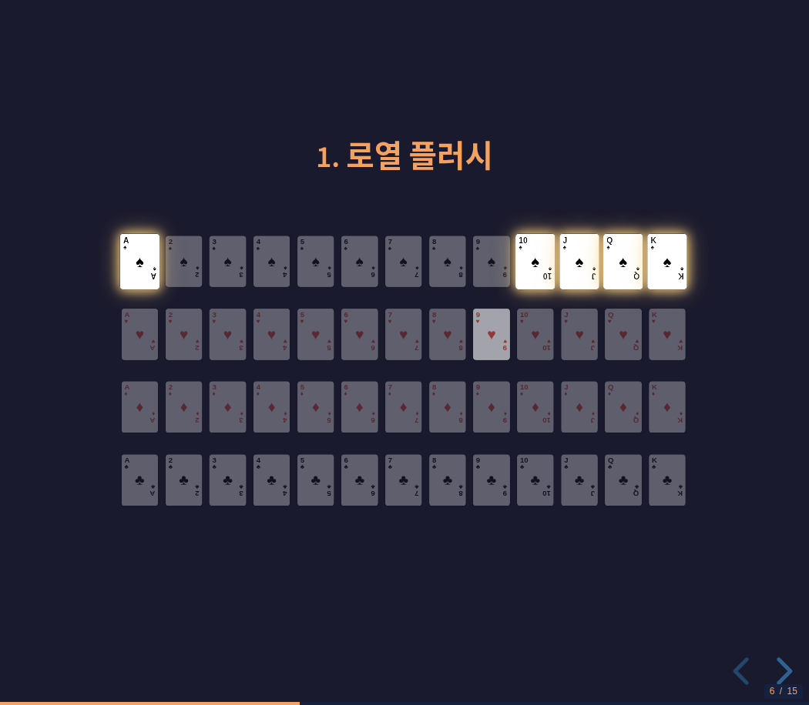
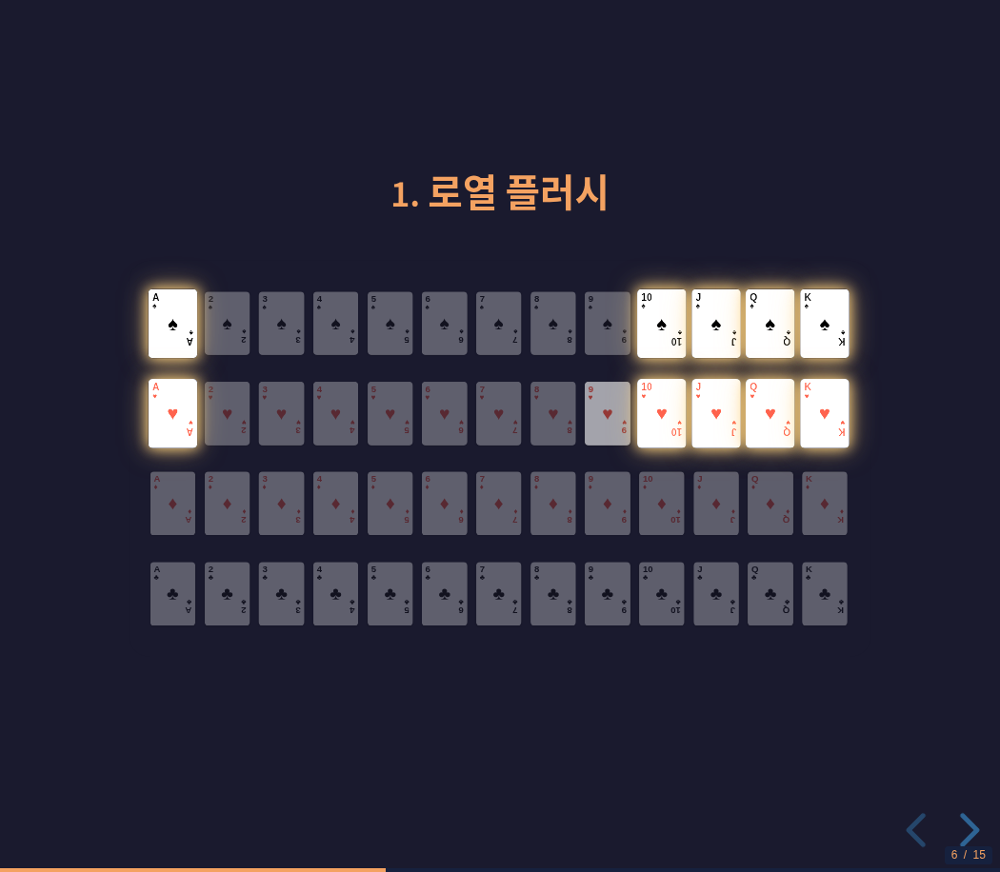
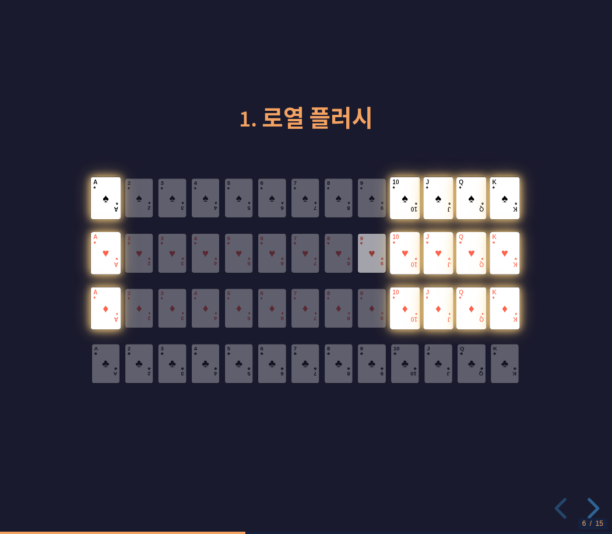
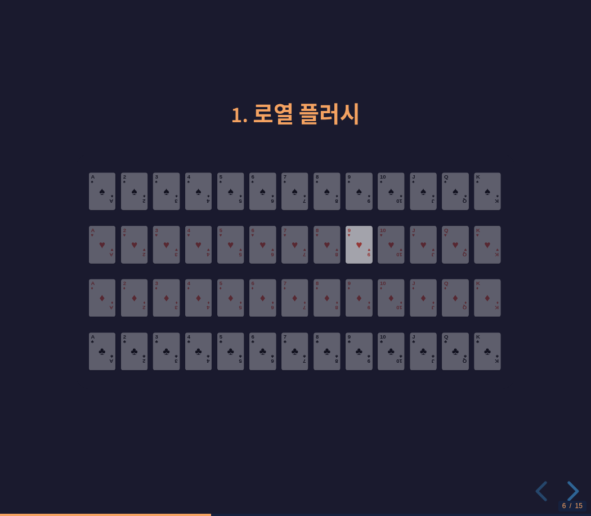
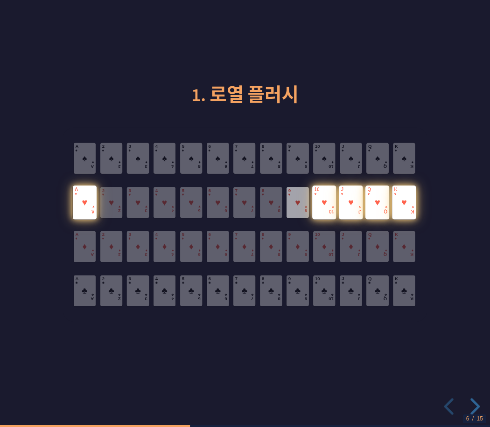
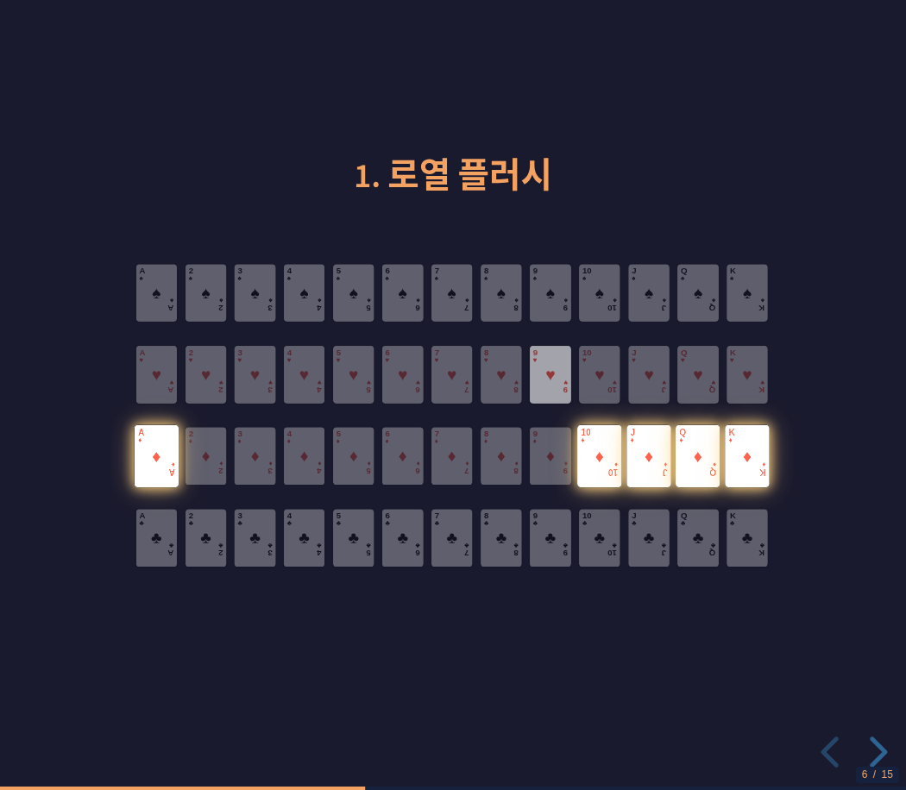
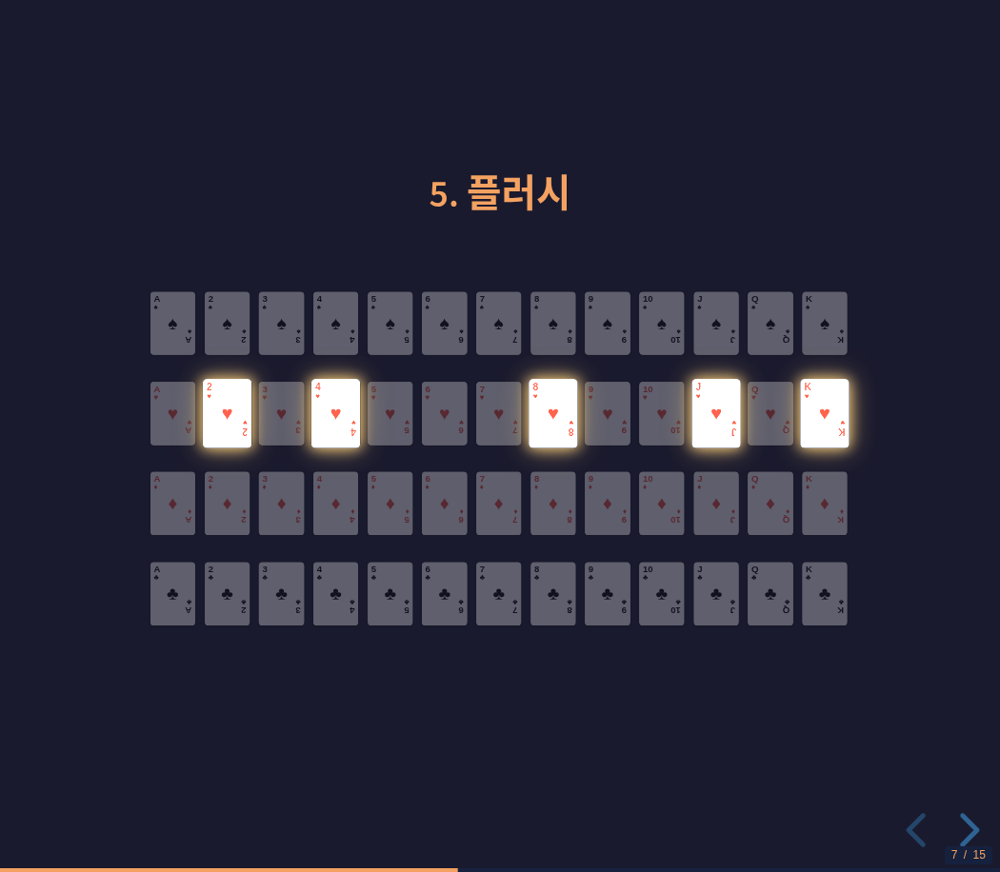

# Reveal.js Fragment 디버깅 - 효율적인 문제 해결 방법론

**작성일**: 2025-01-20
**목적**: CSS/JavaScript 프레임워크 디버깅 시 재사용 가능한 방법론 공유
**소요 시간**: 약 30분 (문제 발견 → 해결 → 검증)

---

## 🎯 문제 정의

### 증상
프레젠테이션에서 52장의 카드 중 특정 조합(5장)을 순차적으로 하이라이트하는 기능:
- **예상 동작**: Fragment 0 → Fragment 1 전환 시, Fragment 0 카드들이 다시 어두워져야 함
- **실제 동작**: Fragment 0 카드들이 계속 밝게 유지됨 (모든 fragment가 누적되어 밝아짐)

### 사용자 피드백
> "불이 꺼진애들은 다른 애들처럼 똑같이 어두워야지"
> "너가 리뷰했을 땐 완벽하다고 생각해?"
> "일일이 설명해주기가 귀찮아"

**핵심**: 사용자가 매번 수동으로 검증하지 않아도 되도록 자동 검증 방법 필요

### 시각적 증거 - 문제 상태 (Before)

#### Fragment 0 활성화 (정상)

*Spades 5장만 밝게 표시 - 이 시점까지는 정상 작동*

#### Fragment 1 활성화 (문제 발생!)

*❌ Hearts 5장이 밝아지면서 Spades 5장도 여전히 밝게 유지됨 → 총 10장 밝음*

#### Fragment 2 활성화 (심각!)

*❌ Diamonds 5장이 추가로 밝아지면서 총 15장이 밝게 표시됨 → Fragment 누적*

**문제 원인**: CSS에서 `.fragment.visible` 선택자 사용
- `.visible` 클래스는 한번 추가되면 제거되지 않음
- 결과: 모든 이전 fragment가 계속 밝게 유지됨

---

## 📐 디버깅 전략

### 1단계: 문제 원인 가설 수립
**가설**: Reveal.js의 `.visible` 클래스가 persist되어 이전 fragment가 계속 표시됨

### 2단계: 공식 문서 확인
- **도구**: WebSearch
- **검색어**: "Reveal.js semi-fade-out fragment documentation 2025"
- **발견**:
  - `fade-in-then-semi-out` 내장 기능 존재
  - `.current-fragment` 클래스가 현재 활성 fragment에만 적용됨
  - `.visible` 클래스는 한번 추가되면 유지됨

### 3단계: 자동 검증 도구 작성
- Python 스크립트로 HTML/CSS 구조 검증
- 브라우저 자동화로 실시간 동작 확인

### 4단계: 점진적 수정 + 즉시 검증
- 수정 → 리로드 → 검증 사이클 반복

---

## 🛠 핵심 도구 활용

### A. WebSearch - 공식 문서 조사

```python
# 검색 쿼리
"Reveal.js semi-fade-out fragment documentation 2025"

# 발견 내용
- fade-in-then-semi-out: 내장 fragment transition
- .current-fragment: 현재 활성 fragment만 해당
- Custom fragment: .fragment.effectname.visible CSS로 정의 가능
```

**교훈**: 프레임워크 문제는 공식 문서에 답이 있다. 코드 수정 전에 먼저 검색.

---

### B. 자동 검증 스크립트 작성

**파일**: `scripts/verify_fragments.py`

```python
#!/usr/bin/env python3
"""
Fragment Implementation Verification Script

Verifies:
1. HTML fragment grouping (data-fragment-index)
2. CSS selectors (.current-fragment)
3. Card counts (52 cards per slide)
"""

# HTML 구조 검증
fragment_pattern = r']*class="fragment"[^>]*data-fragment-index="(\d+)"[^>]*>'
fragments = re.findall(fragment_pattern, slide_content)

# Fragment 카드 개수 확인
fragment_counts = defaultdict(int)
for index in fragments:
    fragment_counts[index] += 1

# 예상: 각 조합은 5장
for index, count in fragment_counts.items():
    if count == 5:
        print(f"  ✅ Fragment {index}: {count} cards (expected 5)")
    else:
        print(f"  ⚠️  Fragment {index}: {count} cards (expected 5, got {count})")
```

**결과**:
```
✅ CSS Selectors: PASS
✅ Card Counts: PASS
✅ 포커 족보 (Royal Flush): 4 groups (각 5장)
✅ 플러시 (Flush): 2 groups (각 5장)
✅ 원 페어 (One Pair): 2 groups (각 5장)
```

**교훈**: 자동 검증 스크립트는 구조적 문제를 즉시 발견. 반복 실행 가능.

---

### C. Chrome DevTools MCP - 실시간 브라우저 검증

**도구 체인**:
1. `navigate_page` - 프레젠테이션 로드
2. `press_key` - Fragment 전환 (Space키)
3. `evaluate_script` - DOM 상태 실시간 검사
4. `take_screenshot` - 시각적 확인

#### 실시간 DOM 검사 예시

```javascript
// Fragment 상태 확인
() => {
  const currentFragments = document.querySelectorAll('.current-fragment');
  const allFragments = document.querySelectorAll('.deck-grid img.fragment');

  return {
    currentFragmentCount: currentFragments.length,
    currentCards: Array.from(currentFragments).map(c => ({
      src: c.src.split('/').pop(),
      opacity: window.getComputedStyle(c).opacity,
      fragmentIndex: c.dataset.fragmentIndex
    }))
  };
}
```

**실행 결과 (Fragment 0 활성)**:
```json
{
  "currentFragmentCount": 5,
  "currentCards": [
    {"src": "AS.svg", "opacity": "1", "fragmentIndex": "0"},
    {"src": "10S.svg", "opacity": "1", "fragmentIndex": "0"},
    {"src": "JS.svg", "opacity": "1", "fragmentIndex": "0"},
    {"src": "QS.svg", "opacity": "1", "fragmentIndex": "0"},
    {"src": "KS.svg", "opacity": "1", "fragmentIndex": "0"}
  ]
}
```

**Space 키 누른 후 (Fragment 1 활성)**:
```json
{
  "fragment0_Spades": [
    {"opacity": "0.3", "isCurrent": false},  // ✅ 다시 어두워짐!
    // ... 5 cards all dim
  ],
  "fragment1_Hearts": [
    {"opacity": "1", "isCurrent": true},     // ✅ 밝아짐!
    // ... 5 cards all bright
  ]
}
```

**교훈**: `evaluate_script`는 computed styles를 정확히 검사. 시각적 확인보다 확실.

---

## 🔧 문제 해결 과정

### Step 1: CSS 선택자 수정

**Before**:
```css
.deck-grid img.fragment.visible {
  opacity: 1 !important;
  box-shadow: 0 0 25px rgba(244, 162, 97, 1);
  transform: scale(1.08);
}
```

**Problem**: `.visible` 클래스는 fragment가 한번 reveal되면 계속 유지됨

**After**:
```css
.deck-grid img.fragment.current-fragment {
  opacity: 1 !important;
  box-shadow: 0 0 25px rgba(244, 162, 97, 1);
  transform: scale(1.08);
}
```

**Result**: `.current-fragment`는 현재 활성 fragment에만 적용 → **여전히 문제 있음**

---

### Step 2: Reveal.js 기본 동작 발견

**브라우저 검증 결과**:
```javascript
{
  "fragmentCard": {
    "opacity": "0",           // ❌ 0.3이 아니라 0!
    "visibility": "hidden"    // ❌ Reveal.js가 숨김!
  }
}
```

**문제**: Reveal.js가 기본적으로 fragment를 `visibility: hidden`, `opacity: 0`으로 숨김

---

### Step 3: Override Reveal.js 기본 동작

**Solution**:
```css
/* Override Reveal.js default fragment hiding - keep fragments visible but dim */
.deck-grid img.fragment {
  visibility: visible !important;  /* ✅ 항상 보이게 */
  opacity: 0.3 !important;          /* ✅ 기본 dim 상태 */
}

/* Fragment cards - only current fragment is bright */
.deck-grid img.fragment.current-fragment {
  opacity: 1 !important;            /* ✅ 현재 fragment만 밝게 */
  box-shadow: 0 0 25px rgba(244, 162, 97, 1), 0 0 50px rgba(244, 162, 97, 0.6);
  transform: scale(1.08);
  z-index: 10;
  position: relative;
  filter: brightness(1.3);
}
```

**핵심**: `!important`가 필수. Reveal.js의 기본 스타일을 override해야 함.

---

### Step 4: 최종 검증

#### 초기 상태 (모든 카드 dim)

*52장 카드 모두 opacity 0.3 (어두운 상태)*

#### Fragment 0 활성화 (Spades Royal Flush)

*A♠, 10♠, J♠, Q♠, K♠ 5장만 밝게 표시*

#### Fragment 1 활성화 (Hearts Royal Flush)

*이전 Spades 카드들은 다시 어두워지고, Hearts 5장만 밝게 표시*

#### Fragment 2 활성화 (Diamonds Royal Flush)

*Spades, Hearts 모두 어둡고, Diamonds 5장만 밝게 표시*

---

**Fragment 0 → Fragment 1 전환 검증**:

```javascript
// Fragment 0 상태 (이전 fragment)
{
  "fragment0_Spades": [
    {"opacity": "0.3", "isCurrent": false},  // ✅ 다시 어두워짐!
    {"opacity": "0.3", "isCurrent": false},
    // ... all 5 cards dim
  ]
}

// Fragment 1 상태 (현재 fragment)
{
  "fragment1_Hearts": [
    {"opacity": "1", "isCurrent": true},     // ✅ 밝아짐!
    {"opacity": "1", "isCurrent": true},
    // ... all 5 cards bright
  ]
}
```

**시각적 확인**:
- Spades 카드들: 모두 dim (opacity 0.3) ✅
- Hearts 카드들: 황금빛 글로우 + scale 1.08 ✅
- 전환 애니메이션: 부드럽게 0.5s ✅

#### Flush 슬라이드 예시

*Flush 슬라이드에서도 동일한 fragment 동작 확인*

---

## 📊 방법론 요약

### 효율적 디버깅 5단계

```
1. 문제 정의 명확화
   └─ 사용자 피드백을 구체적 동작으로 변환
   └─ 예상 동작 vs 실제 동작 비교

2. 공식 문서 먼저 확인
   └─ WebSearch로 프레임워크 동작 연구
   └─ 내장 기능 확인 (reinvent 방지)

3. 자동 검증 도구 작성
   └─ Python 스크립트로 구조 검증
   └─ 재현 가능, 반복 실행 가능

4. 실시간 브라우저 검증
   └─ Chrome DevTools MCP
   └─ evaluate_script로 DOM 상태 정밀 검사

5. 점진적 수정 + 즉시 확인
   └─ 작은 변경 → 즉시 검증
   └─ 문제 발생 시 rollback 용이
```

---

## 🎯 핵심 도구 조합

### Plan Mode → Research
- WebSearch: 공식 문서, Stack Overflow
- 가설 수립: 문제 원인 추론

### Python Script → Structural Verification
- HTML 구조 검증 (fragment grouping)
- CSS 선택자 검증
- 카드 개수, 파일 존재 여부 등

### Chrome MCP → Runtime Verification
- navigate_page: 실제 환경 로드
- press_key: 사용자 상호작용 시뮬레이션
- evaluate_script: DOM 상태 정밀 검사
- take_screenshot: 시각적 확인

### Combination Pattern
```
Python 스크립트 (구조 검증)
     ↓
Chrome MCP (동작 검증)
     ↓
evaluate_script (상태 확인)
     ↓
Screenshot (시각적 확인)
```

---

## 💡 교훈 (Lessons Learned)

### 1. CSS 프레임워크 Override
- 프레임워크의 기본 동작을 바꿀 때는 `!important` 필수
- computed style을 확인해서 실제 적용 여부 검증
- Specificity만으로는 부족할 수 있음

### 2. 자동 + 수동 검증 조합
- **자동 검증**: 구조적 문제 (HTML, CSS 선택자)
- **수동 검증**: 동작 문제 (fragment 전환, 애니메이션)
- 둘 다 필요! 하나만으로는 부족

### 3. 실시간 DOM 검사의 위력
- `evaluate_script`는 computed styles를 정확히 검사
- Screenshot보다 확실하고 자동화 가능
- Fragment 상태, 클래스 적용 여부 등 모두 확인 가능

### 4. 사용자 경험 개선
- "일일이 설명해주기가 귀찮아" → 자동 검증 도구 제공
- 사용자가 직접 확인할 필요 없도록
- 검증 결과를 명확하게 보고 (✅/❌)

---

## 🔄 재사용 가능한 템플릿

### 다른 CSS/JS 프레임워크 디버깅 시

1. **문제 정의**
   - 예상 동작 vs 실제 동작
   - 구체적인 증상 기록

2. **공식 문서 확인** (WebSearch)
   ```
   "[Framework Name] [Feature] documentation [Current Year]"
   ```

3. **검증 스크립트 작성** (Python)
   ```python
   def verify_structure(html_path, css_path):
       # HTML 구조 검증
       # CSS 선택자 검증
       # 파일 존재 여부 검증
   ```

4. **브라우저 검증** (Chrome MCP)
   ```javascript
   () => {
     const elements = document.querySelectorAll('[selector]');
     return Array.from(elements).map(el => ({
       // 필요한 속성 추출
       computed: window.getComputedStyle(el)
     }));
   }
   ```

5. **점진적 수정**
   - 작은 변경 → 즉시 검증
   - 문제 발생 시 rollback

---

## 📈 성과

### Before
- 문제: Fragment 카드가 계속 밝게 유지
- 사용자 부담: 매번 수동 확인 필요
- 디버깅 어려움: 원인 불명확

### After
- ✅ Fragment 전환 시 이전 카드 자동으로 어두워짐
- ✅ 자동 검증 스크립트 제공 (`verify_fragments.py`)
- ✅ 실시간 브라우저 검증으로 정확한 상태 확인
- ✅ 사용자 확인 없이 자체 검증 완료

### 소요 시간
- 문제 발견: 즉시 (사용자 피드백)
- 원인 분석: ~10분 (WebSearch + DOM 검사)
- 수정 + 검증: ~15분 (CSS 수정 + 브라우저 검증)
- 문서화: ~5분 (자동 검증 스크립트)

**총 30분** 만에 완전한 해결 + 재현 가능한 검증 도구 제공

---

## 🎓 다음 단계

### 이 방법론을 적용할 수 있는 상황
- CSS Animation 디버깅
- JavaScript 이벤트 핸들링
- 반응형 디자인 검증
- 접근성(A11y) 테스트
- 크로스 브라우저 호환성 확인

### 개선 가능한 부분
- Playwright/Selenium으로 완전 자동화
- Screenshot diffing으로 시각적 회귀 테스트
- CI/CD 파이프라인에 검증 스크립트 통합
- 성능 프로파일링 (Performance API)

---

## 📝 요약

**핵심 메시지**:
> 효율적인 디버깅은 올바른 도구 조합과 체계적인 검증 프로세스에서 나온다.

**3가지 핵심 도구**:
1. **WebSearch** - 프레임워크 이해
2. **Python Script** - 구조 검증 (자동화)
3. **Chrome MCP** - 동작 검증 (실시간)

**1가지 핵심 원칙**:
> 사용자가 확인할 필요 없도록 자동 검증 도구 제공

**재사용 가능성**:
이 방법론은 다른 CSS/JavaScript 프레임워크 디버깅에도 그대로 적용 가능.

---

**관련 문서**:
- [Claude Code 프로젝트 가이드](./CLAUDE.md)
- [프레젠테이션 제작 방법론](./claude-code-presentation-methodology.md)
- [검증 스크립트](../scripts/verify_fragments.py)
